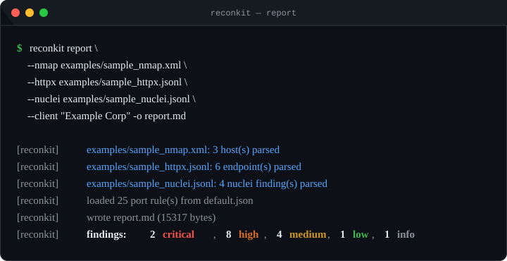

# reconkit

**Turn raw `nmap`, `httpx` and `nuclei` output into a clean, client-ready penetration test report.**

[](https://github.com/micadzo/reconkit/actions/workflows/ci.yml)
[](https://www.python.org/)
[](LICENSE)
[](#design-decisions)

Every penetration test ends the same way: hours lost turning scan output into a document a client
will actually read. `reconkit` does the mechanical part — parse, correlate, order by severity,
render — so the tester can spend that time on the part that needs a human: validating findings and
writing the narrative.



See the generated output in all three formats:

- [`examples/demo_report.md`](examples/demo_report.md) — Markdown
- [`examples/demo_report.html`](examples/demo_report.html) — HTML (self-contained, print-ready)
- [`examples/demo_report.docx`](examples/demo_report.docx) — Word

---

## Why this exists

Writing the report is the part of pentesting that juniors are worst at and that clients judge most
harshly. Most tooling automates *finding* things; almost none automates the boring 80% of
*documenting* them. `reconkit` takes the opposite position: it is deliberately a reporting tool.

It also refuses to overclaim. It does **not** match banners to CVEs. A wrong version-to-CVE mapping
is worse than no mapping, because it burns the tester's credibility in front of the client. Instead,
every detected version is queued in a **manual review** section with the explicit instruction to
check it against vendor advisories.

## Features

- **Parses what you already have** — `nmap -oX` XML, `httpx -jsonl` and `nuclei -jsonl`, the three
  files almost every external recon workflow produces. Findings from all three merge into one report.
- **25 data-driven port rules** covering cleartext legacy services, exposed databases, remote
  management interfaces and container APIs.
- **8 NSE script checks** — anonymous FTP, open SMTP relay, unauthenticated VNC, SMB signing, and
  MS17-010 / Heartbleed / Shellshock / SSLv3 from script output.
- **Web surface checks** — exposed management interfaces (Jenkins, Grafana, phpMyAdmin, …),
  publicly reachable non-production hostnames, cleartext HTTP and sensitive paths such as `/.git/`.
- **Four output formats** — Markdown, self-contained HTML, Word (`.docx`) and machine-readable JSON.
- **Extensible without code** — add a port rule by editing JSON. See [`CONTRIBUTING.md`](CONTRIBUTING.md).
- **`--fail-on SEVERITY`** — exit code `2` when a finding meets a threshold, so reconkit drops
  straight into a CI pipeline.
- **Deterministic** — no network access, no timestamps in the findings, stable sort order.

## Install

`reconkit` has **zero required runtime dependencies** and needs Python 3.9 or newer.

```bash
git clone https://github.com/micadzo/reconkit.git
cd reconkit
pip install -e .
```

DOCX export is opt-in and needs `python-docx`:

```bash
pip install -e ".[docx]"
```

Or run it straight from the source tree without installing anything:

```bash
PYTHONPATH=src python -m reconkit report --nmap scan.xml
```

## Usage

### Build a report

```bash
# Markdown to stdout
reconkit report --nmap scan.xml --httpx probe.jsonl --nuclei nuclei.jsonl

# Full engagement metadata, written to a file
reconkit report \
  --nmap internal.xml --nmap dmz.xml \
  --httpx internal.jsonl \
  --nuclei internal-nuclei.jsonl \
  --client "Example Corp" \
  --engagement "ENG-2024-001" \
  --tester "A. Tester" \
  --date 2024-05-01 \
  --scope 10.0.0.0/24 --scope app.example.com \
  -o report.md
```

### Collect the input files

```bash
nmap -sV -sC -oX scan.xml 10.0.0.0/24
httpx -l hosts.txt -jsonl -o probe.jsonl -title -tech-detect -status-code
nuclei -l hosts.txt -jsonl -o nuclei.jsonl -severity low,medium,high,critical
```

### Output formats

```bash
reconkit report --nmap scan.xml --httpx probe.jsonl --format html -o report.html
reconkit report --nmap scan.xml --httpx probe.jsonl --format docx -o report.docx
reconkit report --nmap scan.xml --httpx probe.jsonl --format json | jq '.summary'
```

`--format docx` writes binary output, so it requires `-o FILE` (not stdout).

### Other commands

```bash
reconkit list-checks                  # print every built-in check
reconkit report --nmap scan.xml --severity-min high -o critical-only.md
```

### In CI

```bash
reconkit report --nmap scan.xml --fail-on high -o report.md
# exit code 2 => at least one high or critical finding
```

| Exit code | Meaning |
|---|---|
| `0` | Report produced, no finding met the `--fail-on` threshold |
| `1` | Usage error, missing file or malformed rules |
| `2` | `--fail-on` gate triggered |

## What it checks

| Family | Count | Source |
|---|---|---|
| Port exposure rules | 25 | `src/reconkit/rules/default.json` |
| nmap NSE script rules | 8 | `checks.py → SCRIPT_RULES` |
| Web surface rules | 4 | `checks.py → _web_rule_findings` |
| nuclei templates | — | mapped 1:1 from `info.severity` |
| Version fingerprints (manual review) | — | collected from nmap and httpx |

Run `reconkit list-checks` for the full list with severities.

Custom rule set:

```bash
reconkit report --nmap scan.xml --rules my-rules.json
```

```json
[
  {
    "id": "EXPOSED-GRAFANA",
    "title": "Grafana dashboard reachable",
    "severity": "medium",
    "ports": [3000],
    "description": "Grafana exposes dashboards, datasource credentials and often unauthenticated admin endpoints.",
    "remediation": "Require authentication, restrict source networks and keep Grafana patched.",
    "references": ["https://grafana.com/docs/grafana/latest/setup-grafana/configure-security/"]
  }
]
```

## Design decisions

**Zero required runtime dependencies.** A security tool that a reviewer can audit in one sitting is
worth more than a convenient one. The core is standard library only: `argparse`, `xml.etree`,
`json`, `dataclasses`, `string.Template`. DOCX export is the single exception and is opt-in.

**Rules as data, logic as code.** Anything that is a fact about a port belongs in JSON and can be
changed without touching Python. Anything that requires interpreting output — NSE scripts, web
fingerprints — stays in code, where it can be tested.

**No CVE matching.** See above. Overclaiming is the fastest way to lose a client's trust.

**Deterministic output.** Same inputs produce byte-identical reports apart from the generation
timestamp, which makes reports diffable between engagement runs.

## Project layout

```
reconkit/
├── src/reconkit/
│   ├── cli.py              # argument parsing, exit codes
│   ├── models.py           # Host, Port, WebTarget, Finding, Report
│   ├── checks.py           # check engine
│   ├── render.py           # Markdown, HTML, DOCX and JSON renderers
│   ├── parsers/
│   │   ├── nmap.py         # nmap -oX XML
│   │   ├── httpx.py        # httpx -jsonl
│   │   └── nuclei.py       # nuclei -jsonl
│   ├── rules/default.json  # 25 port rules
│   └── templates/
│       ├── report.md.tmpl
│       └── report.html.tmpl
├── examples/               # synthetic sample input + demo output
├── docs/demo.svg           # README hero image, generated from real output
├── tools/make_demo_svg.py  # regenerates the hero image
├── tests/                  # 77 unit and end-to-end tests
└── .github/workflows/ci.yml
```

## Development

```bash
pip install -e ".[dev]"
python -m unittest discover -s tests -v
```

77 tests cover the parsers, the check engine, all four renderers and the CLI end to end.

The hero image above is generated from real command output, so it cannot drift out of sync:

```bash
reconkit report --nmap examples/sample_nmap.xml --httpx examples/sample_httpx.jsonl \
  --nuclei examples/sample_nuclei.jsonl -o report.md 2>&1 \
  | grep '^\[reconkit\]' > /tmp/demo.txt
python tools/make_demo_svg.py /tmp/demo.txt docs/demo.svg
```

## Disclaimer

`reconkit` reads files that other tools produced; it never contacts a remote system. It is still a
tool that describes how to attack infrastructure. **Use it only on systems you own or have written
authorisation to test**, and never publish output, hostnames or findings from an engagement without
the owner's consent. Read [`DISCLAIMER.md`](DISCLAIMER.md) before your first run.

## License

MIT — see [`LICENSE`](LICENSE).
